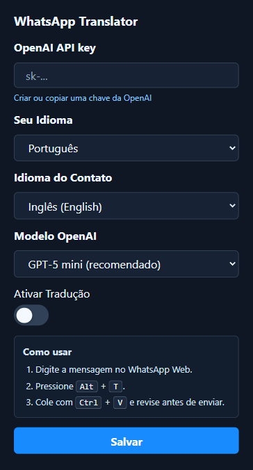

# WhatsApp Web Translator NODEJS

Extensao do Chrome que traduz o rascunho atual da mensagem no WhatsApp Web antes do envio.
Ela tenta aplicar a traducao direto no campo e usa a area de transferencia como fallback.

## Instalacao

1. Instale as dependencias com `npm install`.
2. Gere o background empacotado com `npm run build`.
3. Abra o Chrome e acesse `chrome://extensions`.
4. Ative o **Modo do desenvolvedor**.
5. Clique em **Carregar sem compactacao**.
6. Selecione esta pasta do projeto.
7. Abra o popup da extensao.
8. Escolha seu idioma, escolha o idioma do contato e ative a traducao.
9. Abra ou recarregue `https://web.whatsapp.com`.

## Desenvolvimento

Depois de alterar `src/background.js`, rode `npm run build` novamente para atualizar `dist/background.js`.
Para visualizar o popup pelo navegador, rode `npm run preview` e abra `http://127.0.0.1:4173/popup.html`.

## Como usar

1. Digite uma mensagem no WhatsApp Web.
2. Pressione `Alt + T`.
3. A extensao tenta substituir o rascunho pela traducao diretamente no campo.
4. Se o WhatsApp bloquear a substituicao direta, a traducao sera copiada para a area de transferencia.
5. Revise o texto e envie manualmente.

A extensao nao envia mensagens automaticamente.
Ela nao usa APIs internas de envio do WhatsApp Web.

## Configuracoes

- **Seu Idioma** define o idioma em que voce normalmente escreve.
- **Idioma do Contato** define o idioma usado para traduzir o rascunho.
- **Ativar Traducao** ativa ou pausa o atalho `Alt + T`.

## Traducao

A extensao usa `@vitalets/google-translate-api` empacotado no background script. Essa biblioteca usa um endpoint nao oficial do Google Translate, entao pode haver limite de requisicoes ou mudancas futuras no servico.
